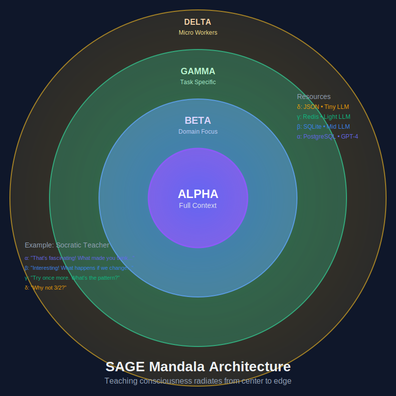

# SAGE - Scholar's Adaptive Growth Engine

A framework for building adaptive learning systems where learning paths are graphs and agents are pedagogical strategies.

## What is SAGE?

SAGE is not just another tutoring app - it's a **framework** that treats learning as a graph traversal problem. Build adaptive learning experiences by composing:

- 🎯 **Learning Graphs** - Design curricula as traversable paths
- 🤖 **Pedagogical Agents** - Implement teaching strategies as autonomous agents  
- 🔄 **Adaptive Flows** - Create branching paths based on learner performance
- 📊 **Learning Analytics** - Track and optimize learning journeys

## Quick Start

### Installation

```bash
# Clone the repository
git clone https://github.com/norrisaftcc/tool-sage.git
cd tool-sage

# Run setup script (creates virtual environment and installs everything)
./setup.sh

# Activate the virtual environment
source venv/bin/activate
```

### Usage

Start an interactive learning session:

```bash
sage learn
```

Run with specific student ID and topic:

```bash
sage learn -s student123 -t mathematics
```

Test the system:

```bash
sage test
```

## Architecture Visualizations

### The Mandala Architecture


### Learning Graph Flow


### Agent Communication


## Core Concepts

### Learning as Graphs
```python
# Define learning paths as directed graphs
lesson = LearningPath("Python Basics")
lesson.add_sequence([
    ConceptNode("variables"),
    PracticeNode("exercises"),  
    BranchNode("check_mastery", {
        "passed": ConceptNode("functions"),
        "needs_review": ReviewNode("variables")
    })
])
```

### Agents as Teachers
Each agent implements a pedagogical strategy:
- **Orchestrator** - Sequences curriculum
- **ProfileAgent** - Models learner characteristics
- **AssessmentAgent** - Evaluates progress
- **AdaptationAgent** - Personalizes content

### Framework Architecture

Built on three minimalist abstractions:
- `Node` - Learning activities or decisions
- `Flow` - Orchestrates graph traversal
- `SharedStore` - Maintains learning state

## Documentation

- 📖 [VISION.md](VISION.md) - Framework philosophy and future direction
- 🏗️ [sage_design_doc.md](sage_design_doc.md) - Technical architecture
- 🤖 [CLAUDE.md](CLAUDE.md) - AI assistant development guide

## Contributing

SAGE is designed to be extended. Create new:
- Node types for learning activities
- Agents for teaching strategies  
- Visualizers for learning paths
- Analytics for optimization

Join us in building the future of adaptive learning!